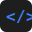

# LogLine



**LogLine** is a lightweight, real-time collaborative code editor where multiple users can open the same document in their browser, edit simultaneously, and see each other's changes instantly.

## 🚀 Live Demo

Open multiple browser tabs at `http://localhost:3003` to test real-time collaboration!

## ✨ Features

### Core Functionality
- **Real-Time Collaboration**: Multiple users can edit the same document simultaneously
- **Live Cursor Tracking**: See where other users are typing with colored cursors and names
- **User Presence**: Know who's editing with random sci-fi themed names
- **Empty Document**: Start fresh with no default content

### Programming Languages
Supports **14 programming languages** with syntax highlighting:

| Language | Execution |
|----------|-----------|
| JavaScript | ✅ Node.js |
| TypeScript | ✅ ts-node |
| Python | ✅ Python 3 |
| Java | ✅ OpenJDK |
| C++ | ✅ GCC |
| Rust | ✅ Rustc |
| Go | ✅ Go runtime |
| HTML | Syntax only |
| CSS | Syntax only |
| JSON | Validation |
| Markdown | Syntax only |
| SQL | Syntax only |
| YAML | Syntax only |
| XML | Syntax only |

### Editor Features
- **Monaco Editor** (VS Code's editor)
- Syntax highlighting
- Line numbers
- Code execution with output console
- Language selection dropdown
- Light, clean UI

## 🛠️ Tech Stack

### Backend
- **Node.js** with TypeScript
- **Socket.IO** for real-time WebSocket communication
- **Redis** for Pub/Sub message broadcasting
- **Docker** for containerization

### Frontend
- **React** with TypeScript
- **Vite** for fast development
- **Monaco Editor** for code editing
- **Socket.IO Client** for real-time sync

### Infrastructure
- **Docker Compose** for orchestration
- **Redis** for cross-instance synchronization

## 🚀 Quick Start

### Prerequisites
- Docker and Docker Compose

### Run the Application

```bash
# Clone the repository
git clone https://github.com/ItiSu/LogLine.git
cd LogLine

# Start all services
docker-compose up --build

# Open http://localhost:3003 in multiple browser tabs
```

Services will be available at:
- **Frontend**: http://localhost:3003
- **Backend**: http://localhost:3002
- **Redis**: localhost:6381

## 🏗️ Architecture

```
┌─────────────┐      WebSocket       ┌─────────────┐
│   Browser   │ ◄──────────────────► │   Backend   │
│  (Client)   │                      │  (Node.js)  │
└─────────────┘                      └──────┬──────┘
                                            │
                                            │ Pub/Sub
                                            │
                                      ┌─────▼─────┐
                                      │   Redis   │
                                      └───────────┘
```

### How It Works

1. **Connection**: User opens the app → Socket.IO connection established
2. **Random Identity**: Server assigns random sci-fi name + unique color
3. **Document Sync**: All edits go through server → broadcast via Redis
4. **Cursor Tracking**: Cursor positions sent in real-time to all users
5. **Code Execution**: Code sent to backend → executed in isolated environment

## 📁 Project Structure

```
LogLine/
├── backend/
│   ├── src/
│   │   └── index.ts          # Main server with Socket.IO & Redis
│   ├── Dockerfile
│   ├── package.json
│   └── tsconfig.json
├── frontend/
│   ├── src/
│   │   ├── App.tsx           # Main React component
│   │   ├── main.tsx          # Entry point
│   │   └── styles.css        # UI styling
│   ├── public/
│   │   └── logo.svg          # App logo
│   ├── Dockerfile
│   ├── package.json
│   └── tsconfig.json
├── docker-compose.yml         # Service orchestration
└── README.md
```

## 🔧 Development

### Backend Development
```bash
cd backend
npm install
npm run dev
```

### Frontend Development
```bash
cd frontend
npm install
npm run dev
```

## 🎨 UI/UX Design

- **Clean & Modern**: Light theme with subtle shadows
- **Non-Generic**: Custom sci-fi themed user names
- **Professional Footer**: Creator attribution with GitHub link
- **Minimal Clutter**: Focus on the code editor

## 🔒 Security

- CORS enabled for cross-origin requests
- Code execution in isolated temporary files
- No persistent storage of user code
- No authentication required (open collaboration)

## 🐳 Docker Services

| Service | Port | Description |
|---------|------|-------------|
| frontend | 3003 | React application |
| backend | 3002 | Node.js API & WebSocket |
| redis | 6381 | Pub/Sub messaging |

## 🤝 Contributing

1. Fork the repository
2. Create your feature branch (`git checkout -b feature/amazing-feature`)
3. Commit your changes (`git commit -m 'Add amazing feature'`)
4. Push to the branch (`git push origin feature/amazing-feature`)
5. Open a Pull Request

## 📝 License

This project is open source and available under the MIT License.

## 👏 Acknowledgments

- Monaco Editor by Microsoft
- Socket.IO team
- Redis team

---

Created by **Itiza Subedi** · [GitHub](https://github.com/itisu)